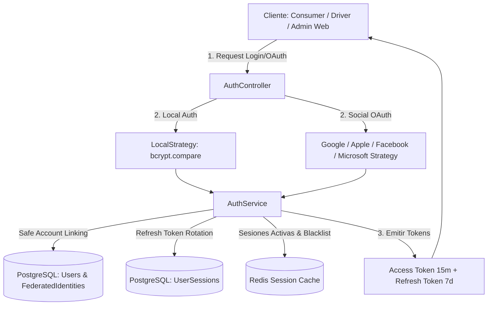

# Walkthrough: Fase 2 - Módulo de Autenticación Federada, Local y Sesiones (Likora API)

Se ha implementado con éxito el módulo completo de autenticación y seguridad en **`backend/api/src/auth`**, integrando Passport.js con soporte para proveedores sociales (Google, Apple, Facebook, Microsoft), autenticación local (Email/Password con bcrypt), emisión de JWTs y gestión de sesiones con rotación de Refresh Tokens y revocación instantánea en Redis.

---

## 1. Arquitectura de Autenticación y Seguridad



---

## 2. Estrategias Passport Implementadas (`src/auth/strategies/`)

1. **[`JwtStrategy`](file:///Ubuntu-24.04/home/gatewayit/external/likora_app/backend/api/src/auth/strategies/jwt.strategy.ts)**:
   - Extracción desde header `Authorization: Bearer <token>` o cookie `access_token`.
   - Valida firma, expiración y verifica en **Redis y PostgreSQL** que la sesión no haya sido revocada ni pertenezca a un usuario suspendido.
2. **[`LocalStrategy`](file:///Ubuntu-24.04/home/gatewayit/external/likora_app/backend/api/src/auth/strategies/local.strategy.ts)**:
   - Validación segura de `email` y `password` contra `password_hash` mediante `bcrypt.compare`.
3. **[`GoogleStrategy`](file:///Ubuntu-24.04/home/gatewayit/external/likora_app/backend/api/src/auth/strategies/google.strategy.ts)**:
   - Scopes `['email', 'profile']`, extracción de `state` para identificar el cliente (`appSource`).
4. **[`FacebookStrategy`](file:///Ubuntu-24.04/home/gatewayit/external/likora_app/backend/api/src/auth/strategies/facebook.strategy.ts)**:
   - Scopes `['email', 'public_profile']`, campos normalizados.
5. **[`MicrosoftStrategy`](file:///Ubuntu-24.04/home/gatewayit/external/likora_app/backend/api/src/auth/strategies/microsoft.strategy.ts)**:
   - Scope `['user.read']`, `tenant: 'common'` (cuentas personales y corporativas).
6. **[`AppleStrategy`](file:///Ubuntu-24.04/home/gatewayit/external/likora_app/backend/api/src/auth/strategies/apple.strategy.ts)**:
   - Sign in with Apple con soporte para clave privada `.p8` y captura de datos `user` en el primer login vía `POST /auth/apple/callback`.

---

## 3. Lógica Central en `AuthService`

- **`validateOAuthUser` (Safe Account Linking)**:
  - Si la identidad federada existe: retorna el usuario.
  - Si no existe pero el email coincide y está verificado (`email_verified = true`): Vincula automáticamente la nueva identidad federada a la cuenta existente sin duplicar usuarios.
  - Si el usuario no existe: crea nuevo usuario (`CONSUMER`, `NOT_STARTED`) y vincula su `FederatedIdentity`.
- **`generateTokens`**:
  - Emite **Access Token** JWT (15 min) con claims: `{ sub, email, role, kycStatus, sessionId }`.
  - Emite **Refresh Token** opaco (7 días) y almacena su hash SHA-256 en `UserSession` (PostgreSQL) y en Redis (`session:<id>`).
- **`refreshTokens` (Refresh Token Rotation + Reuse Detection)**:
  - Invalida el refresh token usado y emite un nuevo par de tokens.
  - **Detección de Reutilización**: Si un atacante intenta usar un refresh token ya revocado, el sistema activa una alarma de seguridad y **revoca inmediatamente todas las sesiones activas del usuario** tanto en DB como en Redis.
- **`logout`**:
  - Marca la sesión como `is_revoked = true` en DB y añade el identificador a la *blacklist* de Redis con TTL.

---

## 4. Endpoints y Callbacks de Autenticación (`src/auth/auth.controller.ts`)

| Método | Ruta | Descripción |
| :--- | :--- | :--- |
| `POST` | `/api/v1/auth/register` | Registro local con email, contraseña y datos personales. |
| `POST` | `/api/v1/auth/login` | Login local con email y contraseña. |
| `POST` | `/api/v1/auth/refresh` | Renovación de Access Token mediante Refresh Token Rotation. |
| `POST` | `/api/v1/auth/logout` | Cierre de sesión y revocación en Redis (Protegido con JWT). |
| `GET` | `/api/v1/auth/me` | Perfil del usuario autenticado, rol y estado KYC (Protegido con JWT). |
| `GET` | `/api/v1/auth/google` | Iniciar flujo OAuth con Google. |
| `GET` | `/api/v1/auth/google/callback` | Callback Google $\rightarrow$ Redirección a Deep Link o Admin Web. |
| `GET` | `/api/v1/auth/facebook` | Iniciar flujo OAuth con Facebook. |
| `GET` | `/api/v1/auth/facebook/callback` | Callback Facebook $\rightarrow$ Redirección. |
| `GET` | `/api/v1/auth/microsoft` | Iniciar flujo OAuth con Microsoft. |
| `GET` | `/api/v1/auth/microsoft/callback` | Callback Microsoft $\rightarrow$ Redirección. |
| `POST` | `/api/v1/auth/apple/callback` | Callback Form POST Sign in with Apple $\rightarrow$ Redirección. |

> **Manejo de Redirección Inteligente**:
> - Para `apps/passenger_app` $\rightarrow$ `likora://oauth/success?access_token=...&refresh_token=...`
> - Para `apps/driver_app` $\rightarrow$ `likoradriver://oauth/success?access_token=...&refresh_token=...`
> - Para `apps/admin_web` $\rightarrow$ `http://localhost:3002/auth/callback?access_token=...&refresh_token=...`

---

## 5. Pruebas Unitarias Automatizadas (`auth.service.spec.ts`)

Se ejecutó la suite de pruebas unitarias con Jest:

```text
PASS src/auth/auth.service.spec.ts
  AuthService (Likora API)
    Registro y Login Local
      ✓ debe registrar un nuevo usuario local y emitir tokens (168 ms)
      ✓ debe iniciar sesión correctamente si el password coincide con bcrypt (214 ms)
      ✓ debe rechazar login si la contraseña es incorrecta (234 ms)
    OAuth y Safe Account Linking
      ✓ debe registrar un nuevo usuario federado si no existe previamente (9 ms)
      ✓ Safe Account Linking: debe vincular nueva identidad social a un usuario existente con el mismo email verificado (5 ms)
    Refresh Token Rotation & Security
      ✓ debe detectar reutilización de refresh token revocado y revocar todas las sesiones del usuario (6 ms)
      ✓ Logout debe revocar la sesión y agregarla a la blacklist de Redis (4 ms)

Test Suites: 1 passed, 1 total
Tests:       7 passed, 7 total
Snapshots:   0 total
```

---

## 6. Variables de Entorno Requeridas ([`.env.example`](file:///Ubuntu-24.04/home/gatewayit/external/likora_app/backend/api/.env.example))

```dotenv
# JWT Secrets
JWT_SECRET=likora_super_jwt_secret_key_2026_change_in_production!

# Redis
REDIS_HOST=localhost
REDIS_PORT=6379
REDIS_PASSWORD=

# Google OAuth 2.0
GOOGLE_CLIENT_ID=your_google_client_id.apps.googleusercontent.com
GOOGLE_CLIENT_SECRET=GOCSPX-your_google_client_secret
GOOGLE_CALLBACK_URL=http://localhost:3000/api/v1/auth/google/callback

# Facebook Login
FACEBOOK_APP_ID=your_facebook_app_id
FACEBOOK_APP_SECRET=your_facebook_app_secret
FACEBOOK_CALLBACK_URL=http://localhost:3000/api/v1/auth/facebook/callback

# Microsoft Identity Platform
MICROSOFT_CLIENT_ID=your_microsoft_client_id_guid
MICROSOFT_CLIENT_SECRET=your_microsoft_client_secret_value
MICROSOFT_CALLBACK_URL=http://localhost:3000/api/v1/auth/microsoft/callback

# Sign in with Apple
APPLE_CLIENT_ID=com.likora.app
APPLE_TEAM_ID=your_apple_team_id
APPLE_KEY_ID=your_apple_key_id
APPLE_PRIVATE_KEY_PATH=/app/keys/AuthKey_apple.p8
APPLE_CALLBACK_URL=https://api.likora.app/api/v1/auth/apple/callback
```
