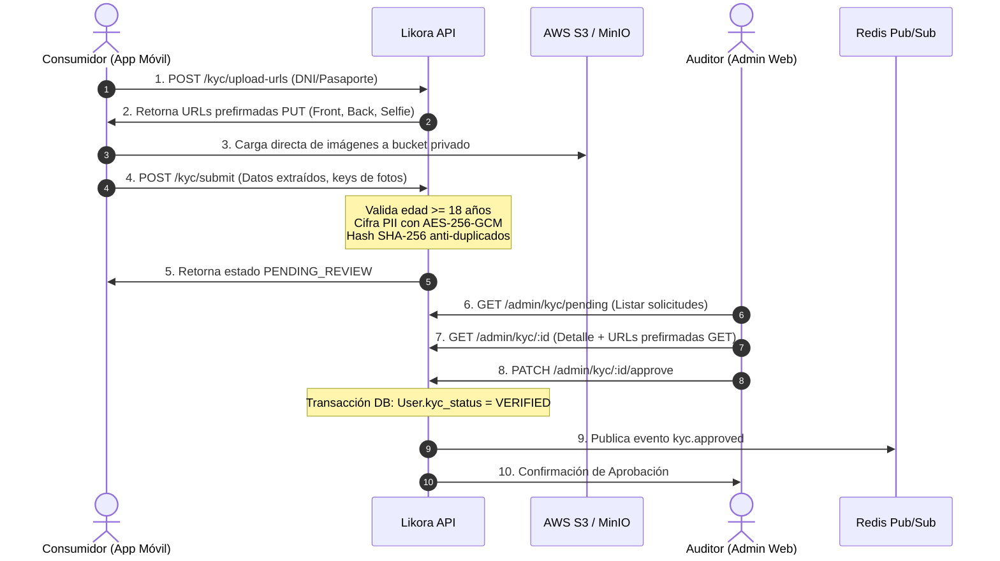

# Walkthrough: Fase 3 - Verificación de Identidad, Mayoría de Edad (+18) y Panel KYC (Likora API)

Se ha implementado el módulo completo de Verificación de Identidad y Cumplimiento Legal de Venta de Alcohol en **`backend/api/src/kyc`**, junto con los servicios transversales de **Criptografía PII (`AES-256-GCM`)** y **Almacenamiento Seguro (`StorageService` con URLs prefirmadas S3/MinIO)**.

---

## 1. Arquitectura de Cumplimiento Legal y Verificación KYC



---

## 2. Componentes y Servicios Implementados

### A. Criptografía de PII ([`CryptoService`](file:///Ubuntu-24.04/home/gatewayit/external/likora_app/backend/api/src/common/crypto/crypto.service.ts))
- **`hashDocumentNumber(docNumber)`**: Genera un hash criptográfico **SHA-256 con Pepper** para indexación y detección instantánea de números de documento duplicados entre diferentes cuentas.
- **`encryptDocumentNumber(docNumber)` & `decryptDocumentNumber(encryptedPayload)`**: Cifrado simétrico autenticado **AES-256-GCM** (con IV de 16 bytes y Auth Tag) para proteger números de identificación en reposo en estricto cumplimiento con normativas de privacidad y protección de datos.

### B. Almacenamiento Seguro ([`StorageService`](file:///Ubuntu-24.04/home/gatewayit/external/likora_app/backend/api/src/common/storage/storage.service.ts))
- **`getPresignedUploadUrl(key, contentType, expiresIn)`**: Genera URLs prefirmadas `PUT` temporales (5 min) para que las apps móviles suban las fotografías de alta resolución directamente a AWS S3 o MinIO, sin saturar los servidores de la API.
- **`getPresignedDownloadUrl(key, expiresIn)`**: Genera URLs prefirmadas `GET` seguras y privadas para que los auditores en `admin_web` puedan revisar los documentos temporalmente sin exponer buckets al público.
- **Estructura de claves en bucket**: `kyc-documents/{userId}/{verificationId}/{front|back|selfie}.jpg`.

### C. Lógica de Negocio y Compliance ([`KycService`](file:///Ubuntu-24.04/home/gatewayit/external/likora_app/backend/api/src/kyc/kyc.service.ts))
- **Bloqueo Automático de Menores de Edad**:
  - Si un usuario envía un documento con fecha de nacimiento correspondiente a una persona menor de 18 años, el sistema actualiza su cuenta a `status = BLOCKED_UNDERAGE`, `kyc_status = REJECTED` y bloquea permanentemente su capacidad de comprar alcohol.
- **Prevención de Fraude / Cuentas Duplicadas**:
  - Valida que el hash del documento no esté ya verificado en otra cuenta activa.
- **Auditoría Backoffice (Aprobación y Rechazo)**:
  - Transacciones atómicas en base de datos para sincronizar `IdentityVerification` y `User`.
  - Notificaciones en tiempo real vía Redis (`kyc.approved`, `kyc.rejected`) para consumo del microservicio de WebSockets.

---

## 3. Endpoints del Módulo KYC

| Rol | Método | Ruta | Descripción |
| :--- | :--- | :--- | :--- |
| `CONSUMER` | `POST` | `/api/v1/kyc/upload-urls` | Solicita URLs prefirmadas para subida de fotos (frontal, dorsal, selfie). |
| `CONSUMER` | `POST` | `/api/v1/kyc/submit` | Envía solicitud de verificación con validación de edad y datos. |
| `CONSUMER` | `GET` | `/api/v1/kyc/status` | Consulta estado actual de KYC y motivo de rechazo si aplica. |
| `ADMIN / SUPPORT` | `GET` | `/api/v1/admin/kyc/pending` | Lista paginada de verificaciones pendientes de auditoría. |
| `ADMIN / SUPPORT` | `GET` | `/api/v1/admin/kyc/:id` | Detalle completo de verificación con documento descifrado y fotos. |
| `ADMIN` | `PATCH` | `/api/v1/admin/kyc/:id/approve` | Aprueba la verificación y habilita compras de alcohol al usuario. |
| `ADMIN` | `PATCH` | `/api/v1/admin/kyc/:id/reject` | Rechaza la verificación con motivo estructurado (`BLURRY_IMAGE`, etc.). |
| `ANY` | `POST` | `/api/v1/orders/checkout-test` | Endpoint de prueba con `@RequireKyc(KycStatus.VERIFIED)` y `KycGuard`. |

---

## 4. Pruebas Unitarias Automatizadas con Jest

Se ejecutó la suite completa de pruebas unitarias cubriendo Criptografía, Autenticación y KYC:

```text
PASS src/common/crypto/crypto.service.spec.ts
PASS src/auth/auth.service.spec.ts
PASS src/kyc/kyc.service.spec.ts
  KycService (Likora Identity & Age Compliance)
    submitVerification
      ✓ debe rechazar y bloquear a usuarios menores de 18 años (Compliance Legal) (14 ms)
      ✓ debe impedir el registro si el documento ya está verificado en otra cuenta (Prevención de Fraude) (3 ms)
      ✓ debe registrar exitosamente la verificación para un usuario mayor de edad (4 ms)
    Auditoría Backoffice (Aprobación y Rechazo)
      ✓ debe aprobar una verificación y emitir evento en Redis (4 ms)
      ✓ debe rechazar una verificación con motivo detallado (3 ms)

Test Suites: 3 passed, 3 total
Tests:       15 passed, 15 total
Snapshots:   0 total
Time:        13.186 s
```

---

## 5. Compilación y Build de Producción

- **`npx tsc --noEmit`**: **0 errores de TypeScript**.
- **`npm run build`**: **Compilación de producción exitosa en `dist/`**.
