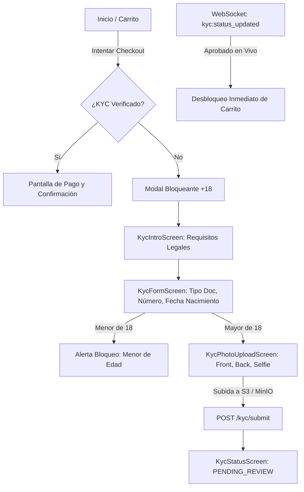

# Walkthrough: Fase 4 - Integración de Clientes y WebSockets (Flutter, Next.js y WebSockets)

Se ha completado la integración de punta a punta de los flujos de autenticación, verificación de edad legal (+18), bloqueo en carrito/checkout y notificaciones en tiempo real en los proyectos clientes del monorepo **Likora**: `apps/passenger_app`, `apps/admin_web` y `backend/socket_service`.

---

## 1. Módulos y Flujos Implementados

### A. App Móvil del Consumidor (`apps/passenger_app` - Flutter)

1. **[`ApiClient`](file:///Ubuntu-24.04/home/gatewayit/external/likora_app/apps/passenger_app/lib/core/services/api_client.dart)**:
   - Gestión automática de tokens `accessToken` y `refreshToken`.
   - Interceptor que detecta respuestas `401 Unauthorized` y ejecuta la rotación automática con `/auth/refresh`.
2. **[`AuthRepository`](file:///Ubuntu-24.04/home/gatewayit/external/likora_app/apps/passenger_app/lib/features/auth/auth_repository.dart)**:
   - Login local con email y password.
   - Registro y soporte para autenticación federada (Google, Apple, Facebook).
3. **Flujo KYC (+18) UI**:
   - **[`KycIntroScreen`](file:///Ubuntu-24.04/home/gatewayit/external/likora_app/apps/passenger_app/lib/features/kyc/kyc_intro_screen.dart)**: Explicación de la obligatoriedad legal para venta de alcohol.
   - **[`KycFormScreen`](file:///Ubuntu-24.04/home/gatewayit/external/likora_app/apps/passenger_app/lib/features/kyc/kyc_form_screen.dart)**: Selector de fecha de nacimiento con cálculo dinámico de edad y advertencia en tiempo real si el usuario es menor de 18 años.
   - **[`KycPhotoUploadScreen`](file:///Ubuntu-24.04/home/gatewayit/external/likora_app/apps/passenger_app/lib/features/kyc/kyc_photo_upload_screen.dart)**: Captura de fotos (frontal, dorsal y selfie de prueba de vida) y subida directa a URLs prefirmadas de S3.
   - **[`KycStatusScreen`](file:///Ubuntu-24.04/home/gatewayit/external/likora_app/apps/passenger_app/lib/features/kyc/kyc_status_screen.dart)**: Visualizador de estados `PENDING_REVIEW`, `VERIFIED` y `REJECTED` (con opción de reintento).
4. **Control de Checkout / Bloqueo en Carrito ([`CartScreen`](file:///Ubuntu-24.04/home/gatewayit/external/likora_app/apps/passenger_app/lib/features/cart/cart_screen.dart))**:
   - Si el usuario no cuenta con estado `VERIFIED`, el botón de pago muestra un diálogo de cumplimiento legal y lo guía al flujo de verificación.

---

### B. Panel de Administración Backoffice (`apps/admin_web` - Next.js 14 / TailwindCSS)

1. **Tabla de Solicitudes Pendientes ([`/admin/kyc`](file:///Ubuntu-24.04/home/gatewayit/external/likora_app/apps/admin_web/src/app/admin/kyc/page.tsx))**:
   - Listado en vivo de solicitudes en estado `PENDING_REVIEW`.
   - Búsqueda por nombre o correo, indicador de edad calculada con alertas visuales para usuarios de 18 años recién cumplidos.
2. **Visualizador y Auditoría de Documentos ([`/admin/kyc/[id]`](file:///Ubuntu-24.04/home/gatewayit/external/likora_app/apps/admin_web/src/app/admin/kyc/[id]/page.tsx))**:
   - Inspección simultánea de las 3 fotografías (Anverso, Reverso, Selfie de prueba de vida).
   - Herramientas de visualización (Zoom, Rotación de 90°).
   - Acciones de auditoría:
     - **Aprobar**: Llama a `PATCH /admin/kyc/:id/approve` y emite evento en tiempo real.
     - **Rechazar**: Modal con motivos tipificados (`BLURRY_IMAGE`, `EXPIRED_DOCUMENT`, `UNDERAGE_DETECTED`, `NAME_MISMATCH`, etc.) y campo para notas al cliente.

---

### C. Notificaciones en Tiempo Real ([`backend/socket_service`](file:///Ubuntu-24.04/home/gatewayit/external/likora_app/backend/socket_service/src/gateways/tracking.gateway.ts))

- Suscriptor Redis conectado al canal `kyc.events`.
- Retransmisión instantánea de eventos `kyc:status_updated` a la sala privada del usuario (`user_{userId}`).
- `passenger_app` recibe la actualización y desbloquea el carrito de compras en tiempo real sin requerir reinicio.

---

## 2. Verificación de Compilación y Builds de Producción

1. **`backend/socket_service`**:
   - `npm run build` $\rightarrow$ **Exitoso (0 errores)**.
2. **`apps/admin_web`**:
   - `next build` $\rightarrow$ **Exitoso (Páginas estáticas y dinámicas optimizadas)**.
3. **`apps/passenger_app`**:
   - `flutter analyze` $\rightarrow$ **0 errores**.
